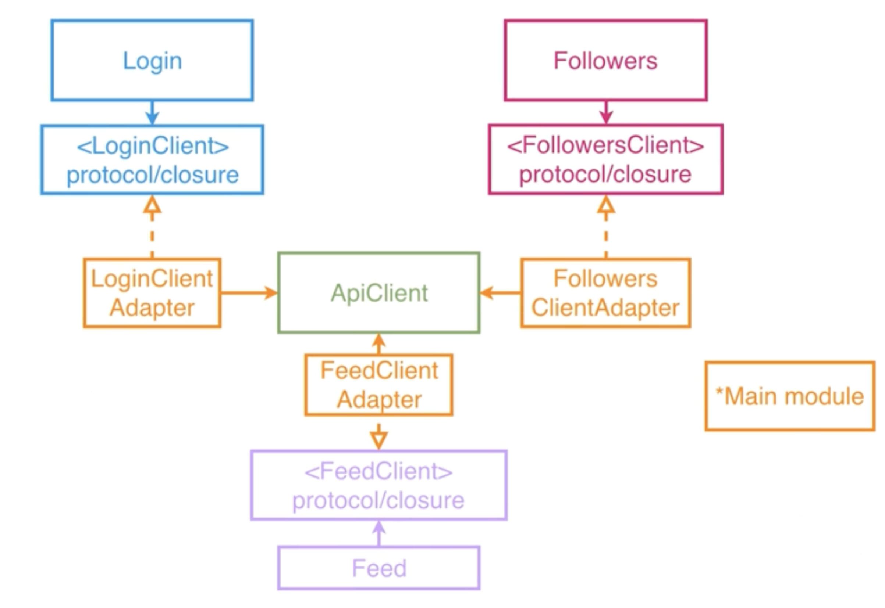

# singletones_ioslec

Example of singleton with shared default implementation but with ability to subclass it, to create mocks and custom implementations. 
In this example ApiClient has no implementation of `login` or `loadFeed` functions which makes it separated from Login and Feed modules. 
Login and Feed modules will extend ApiClient with desired needed functionality

## Diagram

